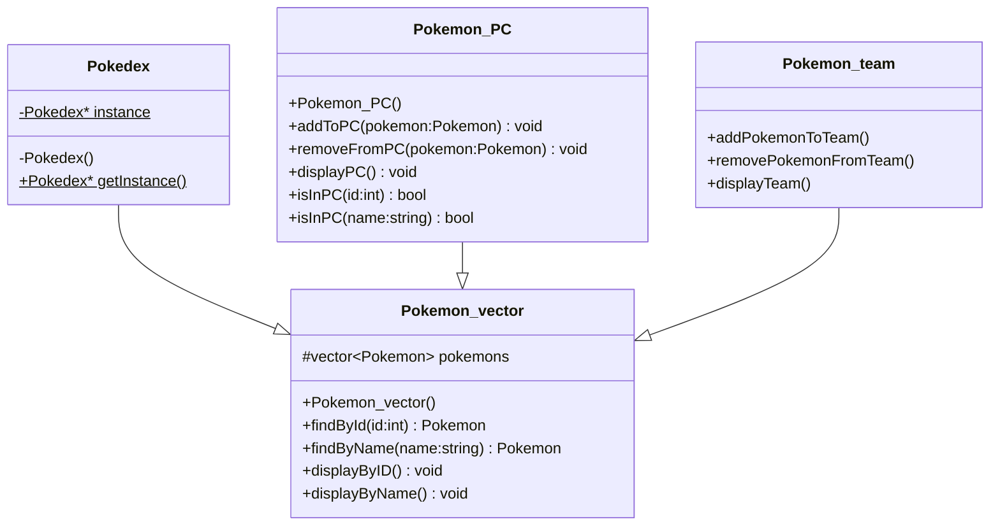

# Introduction au C++ - Pokemon

Ce répository regroupe les travaux réalisés au cours des 3 TPs d'introduction au C++. L'objectif étant de réaliser un squelette de jeu Pokemon qui inclut notamment les phases d'exploration et de combat. Ce projet sert de support concret pour la mise en pratique d'une machine à état.

## Architecture du code
### Pokedex et équipes
Le code gère une base de donnée unique - le Pokedex - mis en place selon la design pattern Singleton. Il se base sur ce Pokedex pour gérer également les Pokemons possédés par un joueur et ceux présent dans son équipe active.   
L'ensemble des méthodes nécessaires se situe dans les classes [Pokedex](/srcpp/Pokedex.cpp), [Pokemon_PC](/srcpp/Pokemon_PC.cpp) et [Equipe](/srcpp/Equipe.cpp). Chacune de ces classes hérite de la classe [Pokemon_vector](/srcpp/Pokemon_vector.cpp).  
Le tout peut être résumé par le diagramme suivant:  

