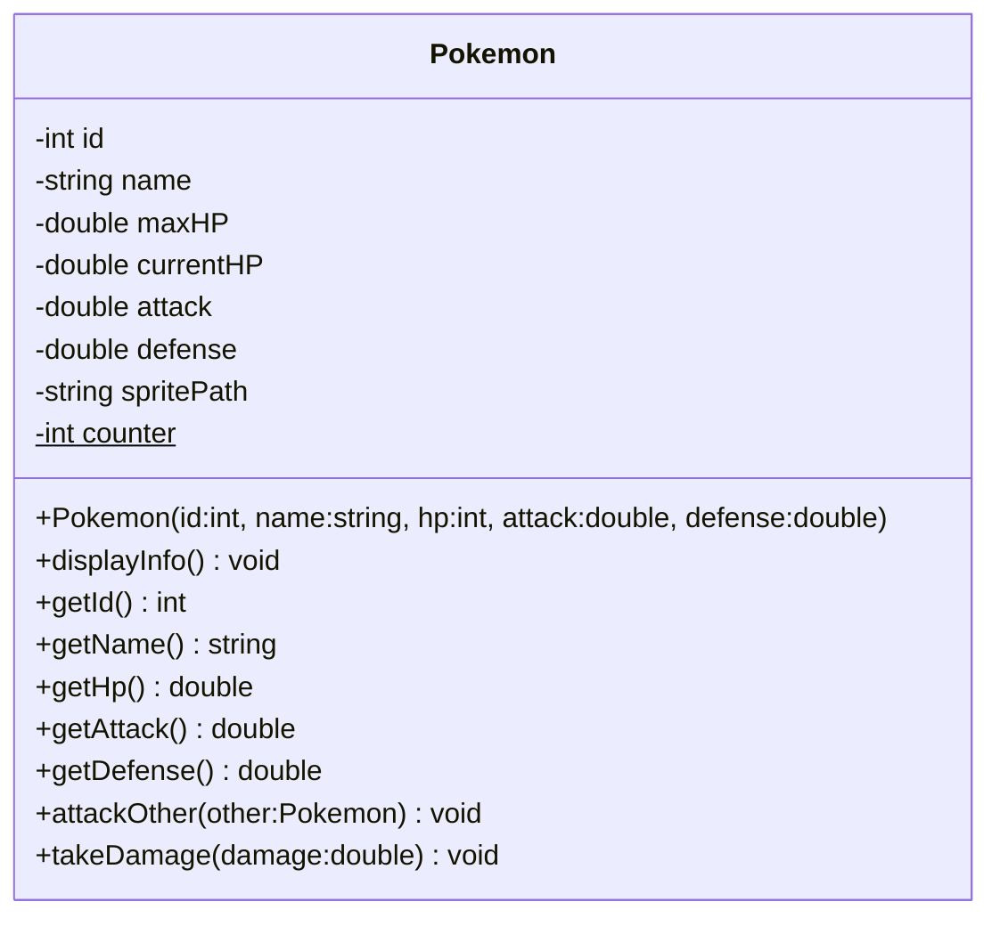
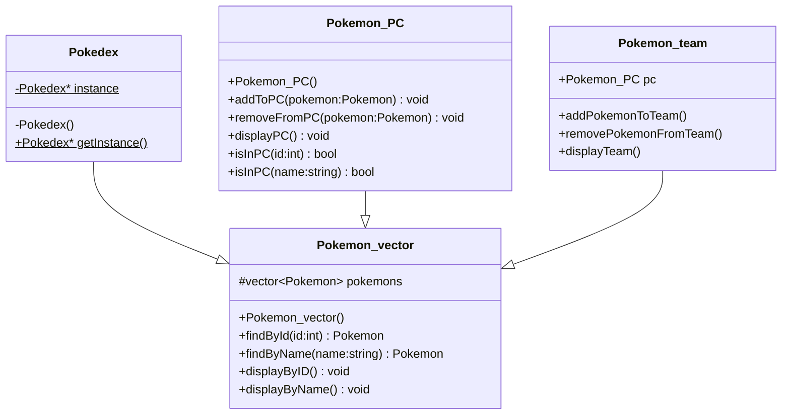
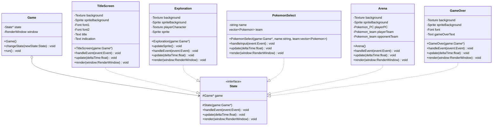

# Introduction au C++ - Pokemon

Ce répository regroupe les travaux réalisés au cours des 3 TPs d'introduction au C++. L'objectif étant de réaliser un squelette de jeu Pokemon qui inclut notamment les phases d'exploration et de combat. Ce projet sert de support concret pour la mise en pratique d'une machine à état.

## Architecture du code
### Pokemons
Le code gère les Pokemons via la classe [`Pokemon`](/srcpp/Pokemon.cpp). Les Pokemons sont caractérisés par un identifiant, un nom, des statistiques (PV, Attaque, Défense). La classe implémente également une méthode d'affichage des informations d'un Pokemon et une méthode de calcul de dégâts pour un combat entre deux Pokemons.

```mermaid
classDiagram
    class Pokemon {
        -int id
        -string name
        -double maxHP
        -double currentHP
        -double attack
        -double defense
        -string spritePath
        -int counter$
        +Pokemon(id:int, name:string, hp:int, attack:double, defense:double)
        +displayInfo()void
        +getId()int
        +getName()string
        +getHp()double
        +getAttack()double
        +getDefense()double
        +attackOther(other:Pokemon)void
        +takeDamage(damage:double)void
    }
```

### Pokedex et équipes
Le code gère une base de donnée unique - le Pokedex - mis en place selon la design pattern Singleton. Il se base sur ce Pokedex pour gérer également les Pokemons possédés par un joueur et ceux présent dans son équipe active.   
L'ensemble des méthodes nécessaires se situe dans les classes [`Pokedex`](/srcpp/Pokedex.cpp), [`Pokemon_PC`](/srcpp/Pokemon_PC.cpp) et [`Pokemon_team`](/srcpp/Equipe.cpp). Chacune de ces classes hérite de la classe [`Pokemon_vector`](/srcpp/Pokemon_vector.cpp).  
Le tout peut être résumé par le diagramme suivant:  

```mermaid
classDiagram
    class Pokemon_vector {
        #vector~Pokemon~ pokemons
        +Pokemon_vector()
        +findById(id:int)Pokemon
        +findByName(name:string)Pokemon
        +displayByID()void
        +displayByName()void
    }
    class Pokedex {
        -Pokedex* instance$
        -Pokedex()
        +Pokedex* getInstance()$
    }
    class Pokemon_PC {
        +Pokemon_PC()
        +addToPC(pokemon:Pokemon)void
        +removeFromPC(pokemon:Pokemon)void
        +displayPC()void
        +isInPC(id:int)bool
        +isInPC(name:string)bool
    }
    class Pokemon_team {
        +Pokemon_PC pc
        +addPokemonToTeam()
        +removePokemonFromTeam()
        +displayTeam()
    }
    Pokedex --|> Pokemon_vector
    Pokemon_PC --|> Pokemon_vector
    Pokemon_team --|> Pokemon_vector
```  

Le Pokedex est créé à partir d'un fichier CSV. C'est également un singleton, on ne peut donc pas instancier plusieurs objets de cette classe. On y accède via la méthode statique `Pokedex::getInstance()`.  
Le joueur possède un PC représenté par la classe `Pokemon_PC` et une équipe active représentée par la classe `Pokemon_team` limitée à 6 pokemons utilisés en combat. Le PC et l'équipe partage les mêmes Pokemons, ainsi sortir un Pokemon de l'équipe le remet dans le PC et inversement.

### Machine à état
Le code utiliser la design pattern State pour gérer les différentes phases du jeu. Chaque phase est représentée par une classe dérivée de la classe abstraite `State`. Le diagramme suivant illustre cette architecture:

```mermaid
classDiagram
    class State {
        <<interface>>
        #Game* game
        #State(game:Game*)
        +handleEvent(event:Event)void
        +update(deltaTime:float)void
        +render(window:RenderWindow)void
    }
    class Game {
        -State* state
        -RenderWindow window
        +Game()
        +changeState(newState:State)void
        +run()void
    }
    class TitleScreen {
        -Texture background
        -Sprite spriteBackground
        -Font font1
        -Font font2
        -Text title
        -Text indication
        +TitleScreen(game:Game*)
        +handleEvent(event:Event)void
        +update(deltaTime:float)void
        +render(window:RenderWindow)void
    }
    class Exploration {
        -Texture background
        -Sprite spriteBackground
        -Texture playerCharacter
        -Sprite sprite
        +Exploration(game:Game*)
        +updateSprite()void
        +handleEvent(event:Event)void
        +update(deltaTime:float)void
        +render(window:RenderWindow)void
    }
    class PokemonSelect {
        -string name
        vector~Pokemon~ team
        +PokemonSelect(game:Game*, name:string, team:vector~Pokemon~)
        +handleInput(event:Event)void
        +update(deltaTime:float)void
        +render(window:RenderWindow)void
    }
    class Arena {
        -Texture background
        -Sprite spriteBackground
        -Pokemon_PC playerPC
        -Pokemon_team playerTeam
        -Pokemon_team opponentTeam
        +Arena()
        +handleEvent(event:Event)void
        +update(deltaTime:float)void
        +render(window:RenderWindow)void
    }
    class GameOver {
        -Texture background
        -Sprite spriteBackground
        -Font font
        -Text gameOverText
        +GameOver(game:Game*)
        +handleEvent(event:Event)void
        +update(deltaTime:float)void
        +render(window:RenderWindow)void
    }
    Game o--> State
    TitleScreen ..|> State
    Exploration ..|> State
    PokemonSelect ..|> State
    Arena ..|> State
    GameOver ..|> State
```
Les différents états `TitleScreen`, `Exploration`, `PokemonSelect`, `Arena` et `GameOver` implémentent l'interface State. La classe `Game` gère la fenêtre du jeu et le changement d'état via la méthode `changeState()`. La méthode `run()` est executée indéfiniment pour appeler les méthodes `handleEvent()`, `update()` et `render()` de l'état en cours pour gérer les événements, mettre à jour la logique du jeu et dessiner les éléments à l'écran.  
La boucle de jeu est: Le joueur passe de l'écran d'accueil à l'exploration en appuyant sur Enter, il peut ensuite se déplacer pour choisir un dresseur a affronter. S'il rentre dans une boite de collision l'état change pour `PokemonSelect` où il choisit son équipe. Ensuite l'état change pour `Arena` où le combat se déroule. Si le joueur perd, l'état change pour `GameOver`.
